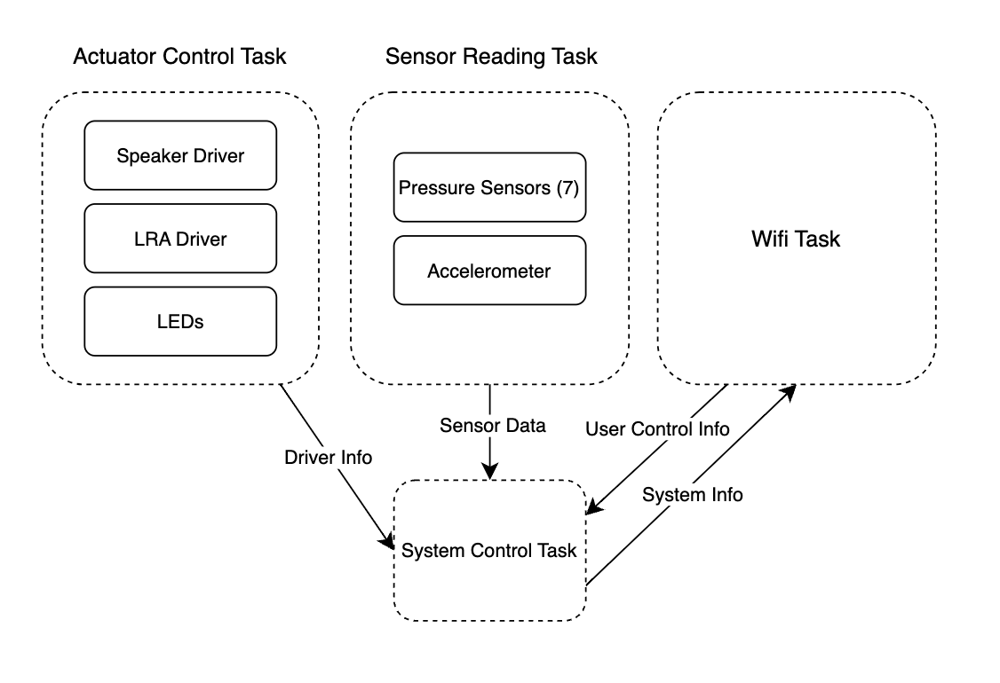
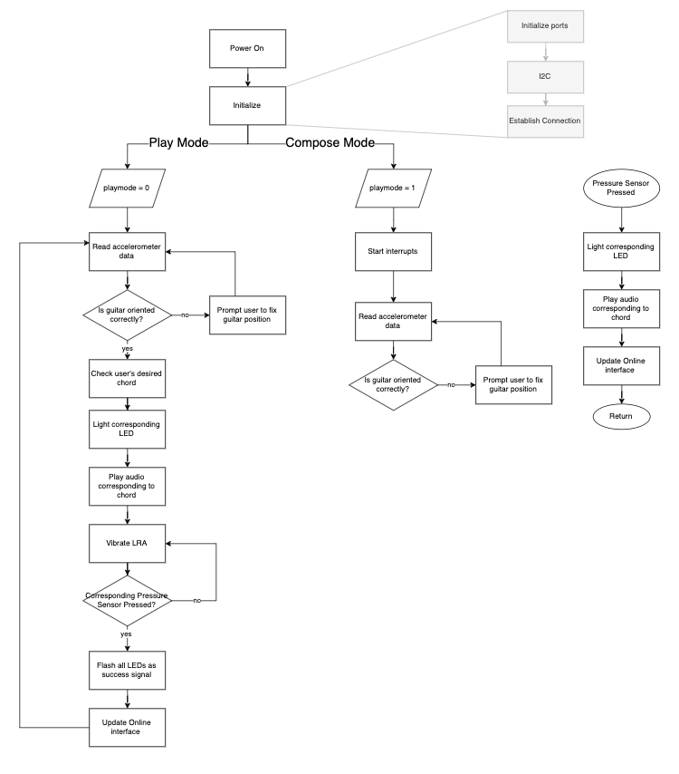
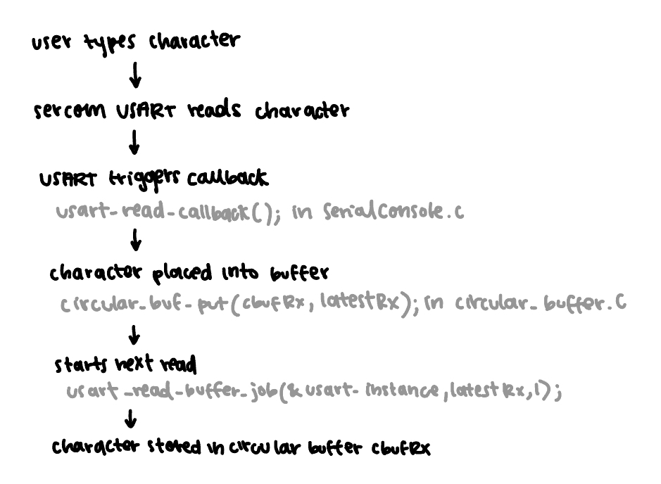
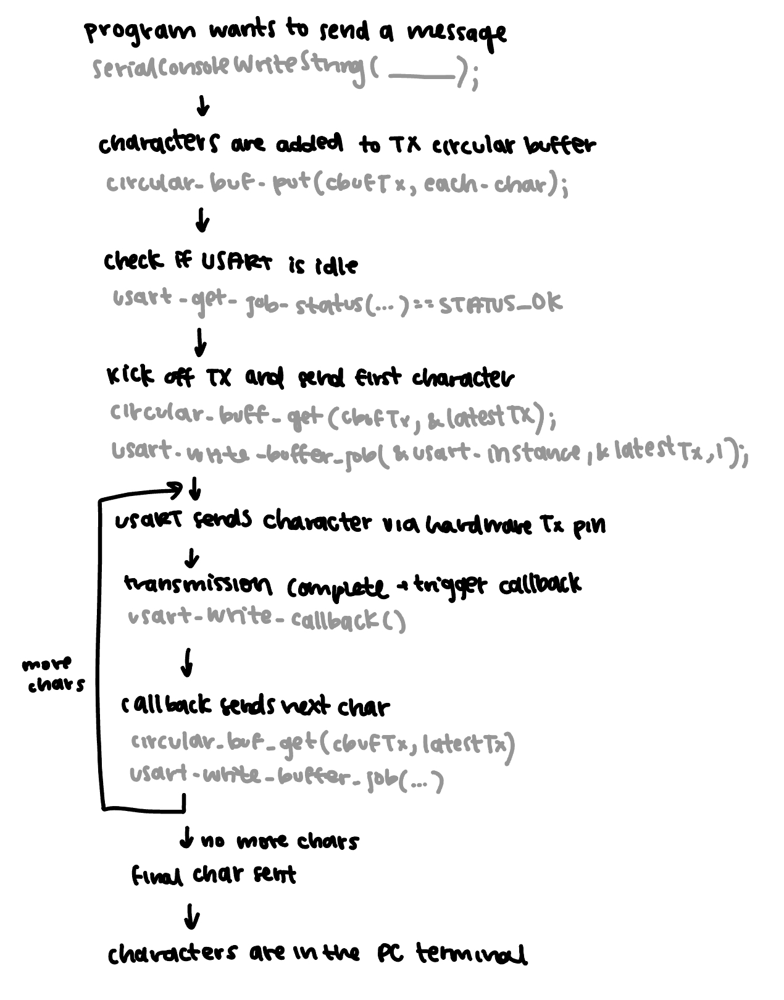

# a07g-exploring-the-CLI

* Team Number: 01
* Team Name: AA Batteries
* Team Members: Ashley Tang and Arushi Mittal
* GitHub Repository URL: https://github.com/ese5160/final-project-a07g-a14g-t01-double-aa-batteries
* Description of test hardware: (development boards, sensors, actuators, laptop + OS, etc)

# Part 1

Updated HRS and SRS

## Hardware Requirements Specification (HRS)

Version 1

* HRS 01: The device shall be based on the SAMD21 microcontroller for the main system and the ESP32 microcontroller for the guitar pick interface.
* HRS 02: The system shall use a LiPo battery (3.7–4.2V) for power, with a boost circuit (5V) and buck circuit (3.3V) for appropriate voltage regulation.
* HRS 03: Pressure sensors shall detect button presses (simulating playing chords) and transmit data to the MCU using ADC (Analog-to-Digital Conversion) pins.
* HRS 04: The device shall include a Wi-Fi controller (WINC 1500) for IoT connectivity.
  Version 2
* HRS 05: LEDs shall be included to prompt the user, indicating the chord to be played.
* HRS 06: The system shall include a haptic module (linear resonant actuator) integrated into the guitar pick to prompt strumming actions wirelessly.
* HRS 07: The system shall incorporate on/off buttons for user control over power and WiFi connectivity.
  Version 3
* HRS 08: The guitar attachment shall house all essential sensors and actuators, detachable from the guitar for portability.
* HRS 09: The device shall have a speaker for audible prompting functionality, enabling voice-based instructions during training modules.
* HRS 10: The on-board accelerometer shall sense and transmit the guitar’s orientation, to provide feedback to the user for correcting the orientation of the guitar.
  Version 4
* HRS 11: The PCB shall include proper shielding to minimize interference between wireless communication and other components.

## Software Requirements Specification (SRS)

6.1 -- Overview
The device has multiple features that build off each other:

1. Pressing the guitar strings
2. Prompting the user to press the button
3. Prompting the user to press the buttons in the order of the song while strumming a specific pattern

As a result, to develop the software of this device, we will use an iterative appraoch. We will have different versions of the prototype, adding functionality to the device with each iteration.

Version 1
For the first version, the device will be able to help the user play specific chords by pressing a button that is easy for people with accessibility needs to push. The device will also transmit what chord is being pressed to the user's phone or online dashboard via IoT capabilities.

Version 2
With the second version of the device, the guitar helper will prompt the user to push a button, based on the chord they want to play and light up the button with an LED so the user knows which button to push. The device will also send a signal to the user's haptic guitar pick so the user knows to strum the guitar.

Version 3
The third iteration of the device will build off of the second iteration, but the user will be able to load specific songs from the online dashboard and the guitar helper will prompt them what buttons to press and will also prompt them when to strum the strings, according to the song, allowing the user to completely independently play music.

Version 4
The fourth iteration of the device will allow the user to choose between two modes. The first mode is loading specific songs from the online dashboard and prompting the user to play the chord and strum. The second mode is a "free compose" mode where the user can play chords and strum the guitar, and the online dashboard records the chord and strumming pattern, effectively allowing the user to compose their own music.

6.2 -- Users
The users of this device will be anybody who wants to learn how to play guitar but has accessibility needs where they lack fine motor skills. This device can also be used by users who have poor hand strength or do not want to commit the time to learn how to play the guitar but want to be able to play music.

6.3 -- Definitions, Abbreviations
6.4 -- Functionality
Version 1

* SRS 01 -- The device will transmit which chord is played to the user's digital dashboard when they push button on the device and strum the strings
  Version 2
* SRS 01 -- The user can select a chord and the device can light up an LED under a button, based on the user's selected chord, prompting them to play the chord
* SRS 02 -- The device sends a signal to the adaptive guitar pick to prompt the user to strum the guitar
* SRS 03 -- The device users the accelerometer data to provide feedback to adjust guitar orientation.
* SRS 04 -- The device prompts the user using vocal cues from the speaker.
  Version 3
* SRS 01 -- The device can light up an LED under a button, based on the user's selected chord, prompting them to play the chord
* SRS 02 -- The device sends a signal to the adaptive guitar pick to prompt the user to strum the guitar
* SRS 03 -- The device users the accelerometer data to provide feedback to adjust guitar orientation.
* SRS 04 -- The device prompts the user using vocal cues from the speaker.
* SRS 05 -- The device is able to prompt the user to play chords and strum the guitar based on the chords and strumming patterns of a song
* SRS 06 -- The user can load songs to play on the device and the device prompts the user to play the chords and strum patterns
  Version 4
* SRS 01 -- When the user is using "playing mode", the device can light up an LED under a button, based on the user's selected chord, prompting them to play the chord
* SRS 02 -- When the user is using "playing mode", the device sends a signal to the adaptive guitar pick to prompt the user to strum the guitar
* SRS 03 -- When the user is using "playing mode", the device is able to prompt the user to play chords and strum the guitar based on the chords and strumming patterns of a song
* SRS 04 -- The user can load songs to play on the device and the device prompts the user to play the chords and strum patterns
* SRS 05 -- When the user switches the mode of the device, the online dashboard will reflect which mode the user is using
* SRS 06 -- When the user is using "composing mode", the dashboard will record which cord is being played and the strumming pattern of the user.
* SRS 07 -- The device users the accelerometer data to provide feedback to adjust guitar orientation.
* SRS 08 -- The device prompts the user using vocal cues from the speaker.

## Block Diagram

## State Machine Flow Chart

# Part 2

1. What does “InitializeSerialConsole()” do? In said function, what is “cbufRx” and “cbufTx”? What type of data structure is it?

   InitializeSerialConsole() initializes the UART and registers callback -- initializes circular buffers for Rx and Tx, configures USART and callbacks, and adds all other calls for initializing serial console.

   cbufRx and cbufTx are both type: cbuf_handle_t
2. How are “cbufRx” and “cbufTx” initialized? Where is the library that defines them (please list the *C file they come from).

   cbufRx and cbufTx are both initalized by functions hidden in the circular buffer library. The file is circular_buffer.c
3. Where are the character arrays where the RX and TX characters are being stored at the end? Please mention their name and size.
   Tip: Please note cBufRx and cBufTx are structures.

   The RX characters are stored in the array rxCharacterBuffer, and TX characters are stored in txCharacterBuffer.
   Both arrays are 512 bytes.
4. Where are the interrupts for UART character received and UART character sent defined?

   The interrupts for UART character received and transmitted are defined in in usart_interrupt.c file
5. What are the callback functions that are called when:

   A character is received? (RX)
   usart_read_callback(struct usart_module *const usart_module)

   A character has been sent? (TX)
   usart_write_callback(struct usart_module *const usart_module)
6. Explain what is being done on each of these two callbacks and how they relate to the cbufRx and cbufTx buffers.

   The USART read callback takes each character in the USART and puts each character one by one into the buffer until there are no more chracters to read. The USART read callback is called when all characters are received successfully.

   The system takes each character in cbufTx and writes each character in the buffer of the desired message over the USART one by one by calling the function usart_write_buffer_job() until there are no more characters to transmit. The USART write callback is called when all characters are sent successfully.
7. Draw a diagram that explains the program flow for UART receive – starting with the user typing a character and ending with how that characters ends up in the circular buffer “cbufRx”. Please make reference to specific functions in the starter code.

   
8. Draw a diagram that explains the program flow for the UART transmission – starting from a string added by the program to the circular buffer “cbufTx” and ending on characters being shown on the screen of a PC (On Teraterm, for example). Please make reference to specific functions in the starter code.

   
9. What is done on the function “startTasks()” in main.c? How many threads are started?

   startTasks() initializes all of the application tasks in the function.
   In FreeRTOS, the number of threads created corresponds to the number of tasks that we are creating. In the example code (before we add code), only 1 task is being created so only 1 thread is being started.

# Part 3

# Part 4

### Questions

1. What nets must you attach the logic analyzer to? (Check how the firmware sets up the UART in SerialConsole.c!)

   We should connect the logic analyzer to nets: TX (Pin PA08), RX (Pin PA09), and GND.
2. Where on the circuit board can you attach / solder to?
3. What are critical settings for the logic analyzer?
   Critical settings for the logic analyzer include baud rate, number of bits sent per character, parity bit (for error checking), stop bits (to signal the end of a character)), idle state, voltage, and sampling rate. These settings are important for the logic analyzer to know how to read the serial data.
